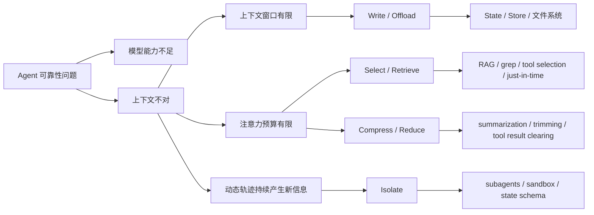

> [!abstract]
> 这份熔炼笔记把 LangChain、Anthropic 和中文案例文章合并成一套可学习的 Context Engineering 课程原料。主线是：上下文不是 prompt 的同义词，而是模型一次推理时看到的全部 token；工程问题不是把东西塞满，而是在有限注意力预算里放入最有用、最少、最不互相冲突的信息。

## 资料来源

| 来源 | 侧重点 | 用在课程中的位置 |
|---|---|---|
| LangChain Blog: Context Engineering for Agents | write / select / compress / isolate 四类策略，Agent 长任务中的上下文问题 | 第 1、3 块 |
| LangChain Docs: Context engineering in agents | agent loop、transient / persistent context、state / store / runtime context、middleware 控制点 | 第 2 块 |
| Anthropic: Effective context engineering for AI agents | context vs prompt、attention budget、context rot、just-in-time retrieval、长任务 compaction / notes / subagents | 第 1、3 块 |
| 微信文章：浅谈上下文工程 | 中文术语转译，Claude Code、Manus、Kiro / Spec Driven 案例 | 第 4 块 |

## 领域术语表

| 术语 | 直觉解释 | 较正式说法 | 常见误解 |
|---|---|---|---|
| Context / 上下文 | 模型这次回答前能看到的全部材料 | 一次 LLM inference 中输入 token 的集合，包括系统提示、消息、工具定义、工具结果、外部资料、记忆、输出格式等 | 只把用户 prompt 当上下文 |
| Context engineering / 上下文工程 | 设计“给模型看什么、何时给、以什么格式给”的系统 | 在有限上下文窗口和注意力预算下，选择、维护、压缩、隔离高信号信息，使模型更稳定地产生目标行为 | 以为它只是 prompt engineering 改名 |
| Prompt engineering / 提示词工程 | 写好指令文本 | 主要优化指令措辞、结构、示例和输出要求 | 以为写好一句提示就能解决长任务可靠性 |
| Attention budget / 注意力预算 | 模型读长材料时的“可用注意力”有限 | Transformer 中 token 间关系随长度增加而变复杂，长上下文会带来检索和推理精度下降 | 以为窗口越大越好，塞满就更聪明 |
| Context rot | 上下文变长后，模型更容易漏看、误用或被噪声影响 | 随 token 数增加，模型从上下文中准确召回信息的能力下降 | 以为只有超出窗口才会出问题 |
| Context poisoning | 错误或幻觉进入上下文后持续污染后续推理 | 错误信息被保留并参与后续决策 | 以为后续模型会自然纠正前面的错 |
| Context distraction | 相关信息太多或太杂，模型被分散 | 大量 token 稀释核心目标和关键证据 | 以为“更多上下文”总比“更少上下文”好 |
| Context clash | 上下文中不同信息互相矛盾 | 指令、记忆、工具返回或历史消息之间冲突，导致行为不稳定 | 以为冲突信息模型能自动做可靠裁决 |
| Write / Offload context | 把信息写到窗口外 | 将计划、观察、用户偏好、文件、工具结果保存到状态、存储、文件系统或数据库 | 以为写出去就是丢掉 |
| Select / Retrieve context | 需要时把信息取回来 | 按任务从记忆、文件、工具、知识库、工具集合中选择相关内容进入窗口 | 把 RAG 当成唯一选择方式 |
| Compress / Reduce context | 保留必要信息，减少 token | 摘要、裁剪、工具结果清理、rerank、层级压缩等 | 以为摘要只要变短就好 |
| Isolate context | 把不同任务的信息分开 | 用子智能体、状态字段、沙盒、环境变量或文件系统隔离上下文 | 以为多 Agent 一定更可靠 |
| Transient context | 只影响当前模型调用 | 动态 prompt、临时消息、可用工具、模型选择、输出格式 | 误以为所有注入都会自动进入长期记忆 |
| Persistent context | 跨步骤或跨会话保存 | state、store、文件、数据库、memory、总结后的历史 | 误以为持久化越多越好 |
| State | 当前会话的短期状态 | 本轮任务内保存的消息、计划、认证状态、临时文件索引等 | 和长期记忆混为一谈 |
| Store | 跨会话长期存储 | 用户偏好、项目规则、长期知识、历史经验 | 把所有 store 内容都默认塞回窗口 |
| Runtime context | 运行时静态配置 | user_id、权限、环境、成本等级、API key、地域规则 | 让模型直接看敏感配置 |
| Just-in-time retrieval | 用到时再取 | agent 通过路径、URL、查询语句、grep/glob 等按需加载资料 | 以为一定比预检索快 |
| Compaction | 接近窗口限制时压缩并重启上下文 | 高保真总结轨迹，保留目标、决策、未解问题和最近关键材料 | 粗暴总结导致细节丢失 |
| Structured note-taking | 让 agent 写结构化笔记 | 在窗口外维护 TODO、NOTES、计划、进展、关键结论 | 只写自然语言流水账 |
| KV cache | 复用相同前缀的推理缓存 | 稳定上下文前缀可降低延迟和输入 token 成本 | 动态改工具或时间戳导致缓存失效 |
| Spec-driven development | 先形成需求、设计和任务，再生成代码 | Prompt -> Requirements -> Design -> Tasks -> Code | 把“写更多文档”当成目标，而不是约束生成和验收 |

## 知识骨架

## 先修依赖

- 了解 LLM 每次回答都依赖输入 token，而不是拥有无限工作记忆。
- 知道 Agent loop：模型调用 -> 工具调用 -> 工具结果返回 -> 再次模型调用。
- 对 RAG、tool calling、system prompt 有基础印象即可；课程页会补齐必要解释。

## 可练习点

- 能区分 prompt engineering 和 context engineering。
- 能列出一个 Agent 模型调用里可能出现的上下文类型。
- 能判断某个失败案例属于 context rot、poisoning、distraction、clash 中哪类。
- 能把同一条信息放到 state、store、runtime context、文件系统或消息历史里，并说明取舍。
- 能为一个 Agent 设计 write / select / compress / isolate 的策略组合。
- 能读懂 LangChain middleware 示例中 request.state、request.runtime.store、request.runtime.context 的语义差异。
- 能解释 just-in-time retrieval 为什么适合代码仓库和动态资料。
- 能判断 compaction、structured note-taking、subagents 分别适合哪种长任务。
- 能从 Claude Code、Manus、Kiro 案例里抽象出可复用设计原则。
- 能写一份上下文工程验收清单，检查 token、延迟、准确率、工具选择和记忆污染风险。

## 资料边界

- LangChain 资料偏框架和抽象分类，对具体产品内部实现只做概念映射。
- Anthropic 资料偏工程原则和 Claude 生态案例，其中部分能力与具体平台实现有关。
- 微信文章提供中文案例和产品观察，但不是所有数字都能从公开一手资料独立验证；课程中把这些内容当作案例线索，而不是硬性事实。
- 本课程不展开模型底层 Transformer 数学，只解释注意力预算和长上下文退化的工程直觉。
- 本课程不要求直接实现完整 Agent 框架，只训练能设计、诊断和验收上下文策略。

## 课程拆分

| 编号 | 知识块 | 核心问题 | 主要来源 |
|---|---|---|---|
| 01 | 从 Prompt 到 Context：为什么 Agent 需要上下文工程 | 为什么写好 prompt 还不够？上下文到底包括什么？ | Anthropic、LangChain Blog、微信文章 |
| 02 | 上下文控制面：State、Store、Runtime 与 Middleware | 在 Agent loop 中，开发者能控制哪些入口？ | LangChain Docs |
| 03 | 四类策略：Write、Select、Compress、Isolate | 长任务里如何保存、取回、压缩和隔离信息？ | LangChain Blog、Anthropic |
| 04 | 产品案例与工程验收：Claude Code、Manus、Kiro | 怎么把原则落到真实产品和开发流程？ | 微信文章、Anthropic、LangChain Blog |

## 来源映射

- 01 的定义采用 Anthropic 的 context / engineering 说法，补充 LangChain 对 Instructions、Knowledge、Tools 的三分。
- 02 采用 LangChain Docs 的 transient / persistent context、model context、tool context、life-cycle context。
- 03 采用 LangChain Blog 的 write / select / compress / isolate 分类，并用 Anthropic 的 compaction、note-taking、sub-agent 长任务策略加厚。
- 04 采用中文文章的 Claude Code / Manus / Kiro 案例，用 Anthropic 的 just-in-time retrieval 和 long-horizon task 原则校准解释。
