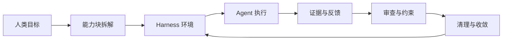

## 来源

- 原文：Harness engineering: Leveraging Codex in an agent-first world
- 作者：Ryan Lopopolo
- 组织：OpenAI Engineering
- 日期：2026-02-11
- 链接：[OpenAI 原文](https://openai.com/zh-Hans-CN/index/harness-engineering/)

## 资料边界

这组学习资料基于原文的工程主线制作：当 Codex 这样的智能体可以持续执行开发任务，人类工程师的工作会从逐行实现，转向设计智能体工作的环境、约束、证据和收敛机制。

本课程不复刻原文叙事，也不把原文中的团队经验直接当作通用生产率承诺。学习重点放在可迁移的工程方法：如何把目标拆成能力块，如何让应用和仓库变得可读，如何把工程品味写成约束，如何在高吞吐后管理系统熵。

## 领域术语表

| 术语 | 直觉解释 | 准确定义 | 常见误解 |
|---|---|---|---|
| Harness | Agent 的工程工作台 | 围绕智能体执行建立的文档、工具、测试、日志、权限、审查和反馈机制 | 以为它只是一条更长的 prompt |
| Agent-first | 先考虑智能体如何执行任务 | 开发流程默认让 Agent 参与实现、验证和迭代，人类负责目标、边界和审查 | 以为人类可以完全退出 |
| 应用可读性 | 运行状态能被 Agent 看见 | UI、日志、指标、trace、截图和本地环境能进入 Agent 的反馈回路 | 只理解成界面更好看 |
| 仓库知识 | 写在仓库里的项目上下文 | AGENTS、README、目录说明、模板、脚手架、测试命令和反例 | 写一份巨大总文档就算完成 |
| 不变量 | 系统演化时不能破坏的条件 | 依赖方向、权限边界、数据一致性、审计要求等硬约束 | 把所有个人偏好都升格成硬规则 |
| 熵 | 系统逐渐变散、变乱 | 重复实现、过期文档、冲突分支、测试噪声和未收敛产物 | 只把熵理解成代码格式问题 |
| 收敛 | 把分散产物合并成稳定系统 | 合并、删除、重构、更新文档、补规则和清理分支 | PR 合并了就一定完成收敛 |

## 知识骨架

核心主线：

1. 人类不再只控制代码行，而是控制任务边界、证据和环境。
2. Agent 的执行质量取决于能读到什么、能运行什么、能验证什么。
3. 应用状态、仓库知识和架构品味都要外化成 Agent 可读的对象。
4. 高吞吐会放大系统熵，必须用审查、清理和规则更新让产物收敛。

## 可练习点

- 把模糊需求改写成可执行能力块。
- 为 Agent 任务写输入、输出、边界和验收证据。
- 为 UI / 后端问题设计截图、日志、指标和 trace 证据。
- 编写目录级 README、AGENTS 片段、任务模板和脚手架说明。
- 把“代码要优雅”这类抽象品味改写成不变量、反例和审查清单。
- 判断多个 Agent 任务是否会发生文件、接口、数据模型或产品决策碰撞。
- 设计高吞吐工作流的清理循环。

## 知识块拆解

| 顺序 | 知识块 | 学习目标 |
|---|---|---|
| 01 | 角色转变与环境设计 | 理解人类从逐行编码转向设计 Agent 工作环境，并能把大需求拆成能力块 |
| 02 | 应用可读性与反馈回路 | 让 UI、日志、指标、trace 成为 Agent 能读取和复盘的证据 |
| 03 | 任务分解与上下文边界 | 把模糊需求拆成可执行任务卡，并用 AGENTS、README、模板、脚手架和目录边界控制上下文 |
| 04 | 架构约束与品味不变量 | 把工程品味转成不变量、反例、测试和审查标准 |
| 05 | 吞吐、自治与熵管理 | 在高并行 Agent 工作流里管理重复、冲突、过期和未收敛产物 |

## 产物入口

- [[课程索引.html]]
- [[01_角色转变与环境设计/学习页.html]]
- [[02_应用可读性与反馈回路/学习页.html]]
- [[03_任务分解与上下文边界/学习页.html]]
- [[04_架构约束与品味不变量/学习页.html]]
- [[05_吞吐自治与熵管理/学习页.html]]
